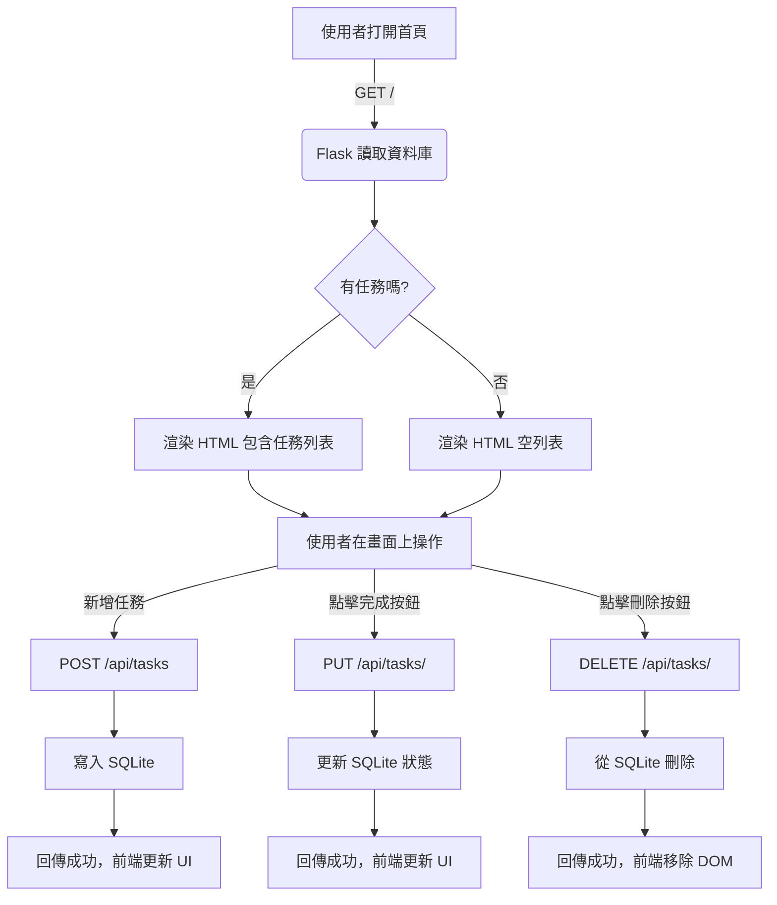

# 系統流程圖 (FLOWCHART)

```mermaid
graph TD
    A[使用者打開首頁] -->|GET /| B(Flask 讀取資料庫)
    B --> C{有任務嗎?}
    C -->|是| D[渲染 HTML 包含任務列表]
    C -->|否| E[渲染 HTML 空列表]
    
    D --> F[使用者在畫面上操作]
    E --> F
    
    F -->|新增任務| G[POST /api/tasks]
    G --> H[寫入 SQLite]
    H --> I[回傳成功，前端更新 UI]
    
    F -->|點擊完成按鈕| J[PUT /api/tasks/<id>]
    J --> K[更新 SQLite 狀態]
    K --> L[回傳成功，前端更新 UI]
    
    F -->|點擊刪除按鈕| M[DELETE /api/tasks/<id>]
    M --> N[從 SQLite 刪除]
    N --> O[回傳成功，前端移除 DOM]
```
